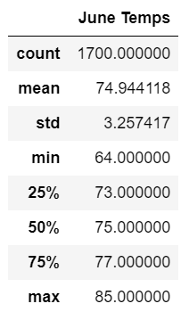
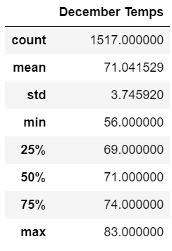
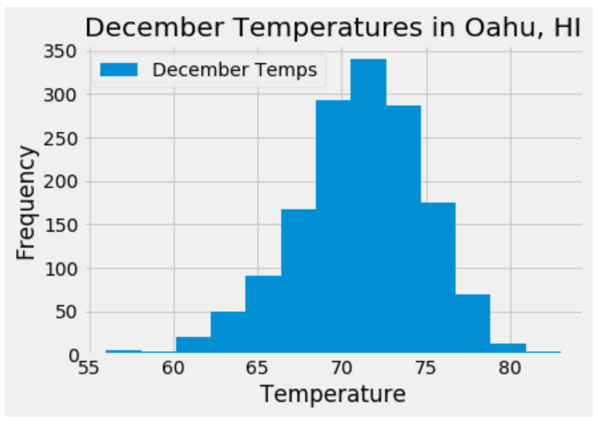
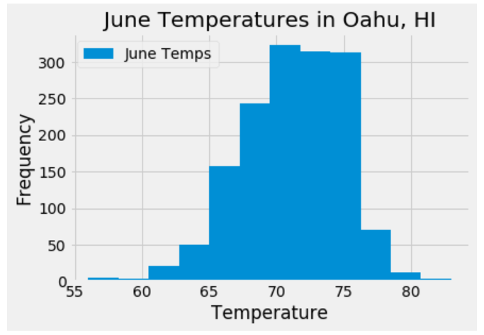

# Surfs_Up

## Project Overview
W. Avy is interested in investing in a surf board and ice cream shop slated to open in Oahu, HI, but he is concerned about the impact of poor weather on the business. To convince me to invest, an analysis was performed on weather data, including percripitation levels and monthly temperatures, as well as station activity. A final analysis was performed on the temperature data for June and December to determine if the shop is sustainable throughout the whole year.

## Resources
Data Sources: [hawaii.sqlite](Resources/hawaii.sqlite)
 
Software: Jupyter Notebook, Python 3.7.6

## Results
### Key Differences in Weather Between June and December

 
 
- The average temperature in June is ~75F, while the average temperature in December is 71F.
- In December, temperatures can be as low as 56F, but the lowest temperature recorded in June was 64F.
- The highest temperature recorded for June was 85F and 83F for December.

## Summary
The analysis showed that overall, temperatures tend to be higher in the month of June than in December. However, temperatures remain pretty mild during both months. Sales may slow during the colder days in December, as the low can be in the 50s. This should not be a concern, as further analysis revealed that in December, a higher frequency of days had temperatures between 68F and 74F (Graph 1). In June, temperatures are frequently between 69F and 72F (Graph 2). The results show that W. Avy can feel confident investing in the surf board and ice cream shop.
 
 
**Graph 1**

 

 

**Graph 2**

 

